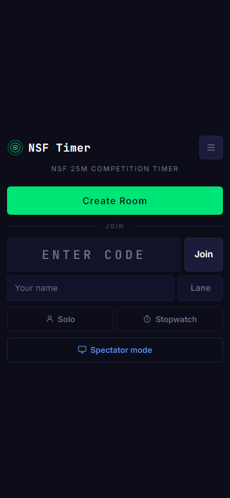
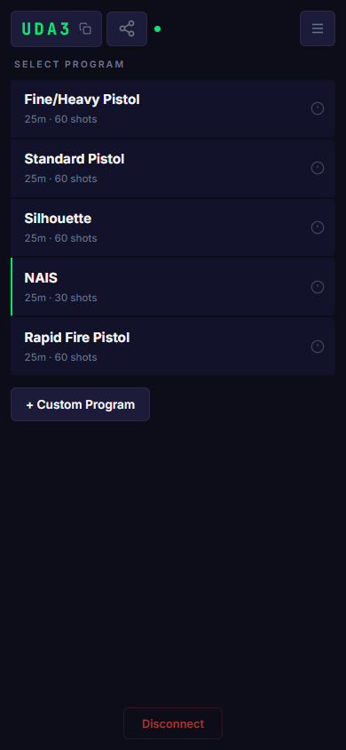
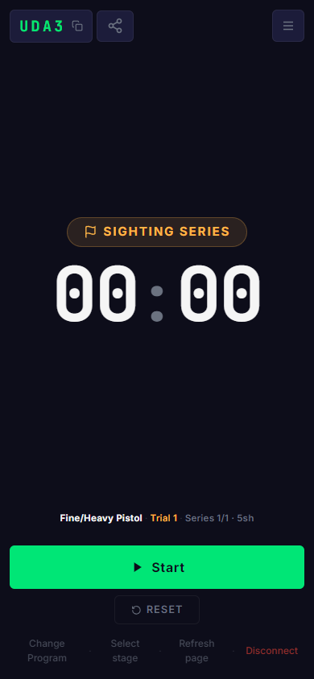
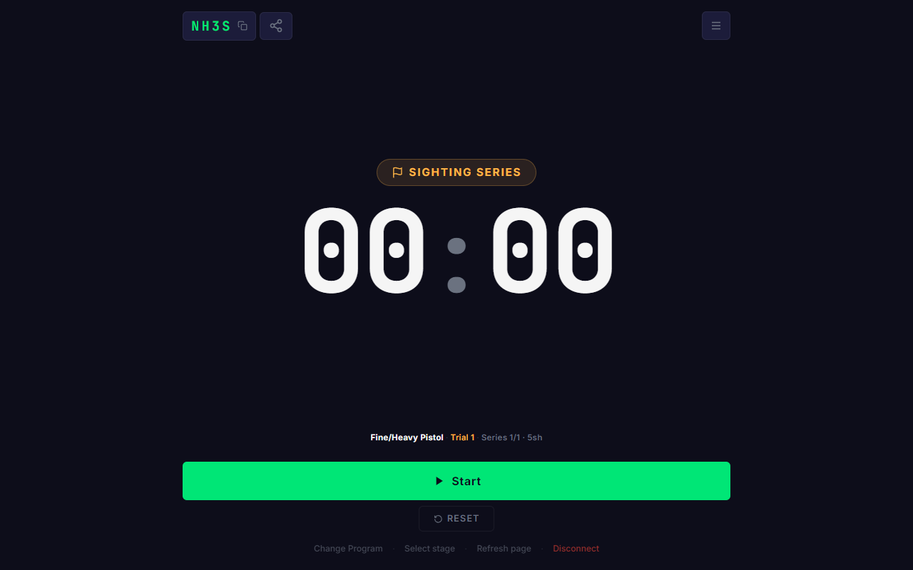

<p align="center">
  
</p>

<h1 align="center">NSF Timer</h1>

<p align="center">
  Synchronized timer for NSF 25m shooting competitions.<br>
  Install it on any phone, tablet, or computer and run competitions across multiple devices.
</p>

<p align="center">
  
  &nbsp;&nbsp;
  
  &nbsp;&nbsp;
  
</p>

<p align="center">
  
</p>

## Features

- **Built-in NSF programs** — Fine/Heavy Pistol, Standard, Silhouette, NAIS, Rapid Fire with full stage/series timing
- **Custom programs** — Create, edit, and delete your own competition programs
- **Multi-device sync** — Host creates a room, shooters join by 4-character code. Timer state syncs in real-time via WebSocket
- **Precision, Rapid & Duel modes** — Countdown timers for precision stages, hidden/visible cycling for rapid-fire and duel stages
- **Malfunction handling** — Track jams per shooter (max 2 per program, 1 per stage) with reshoot support
- **Solo mode** — Run a full competition program locally without creating a room
- **Spectator mode** — View-only mode for spectators to follow the competition timer
- **Bilingual** — Norwegian and English
- **Offline-capable PWA** — Install to home screen, works without internet after first load
- **Standalone stopwatch** — Simple stopwatch mode independent of the competition system
- **Settings** — Text scaling, sound toggle, screen wake lock, countdown format

## How it works

1. **Host** creates a room and selects a shooting program
2. **Shooters** join with the room code, their name, and lane number
3. Host controls the timer — start, pause, stop, reset
4. All connected devices display the synchronized countdown in real-time

## Self-hosting with Docker

The Docker image bundles the Svelte frontend and WebSocket relay server into a single container. Nginx serves the static files and proxies `/ws` to the Node.js relay server internally.

```bash
docker run -d -p 80:80 ghcr.io/gilbn/nsf-timer:latest
```

Access the app at `http://<server-ip>/`.

For internet-facing deployments, restrict WebSocket origins:

```bash
docker run -d -p 80:80 \
  -e WS_ALLOWED_ORIGINS=https://timer.example.com \
  ghcr.io/gilbn/nsf-timer:latest
```

For HTTPS, place the container behind a reverse proxy (e.g. Caddy, Traefik, nginx Proxy Manager) that handles TLS termination. The app automatically upgrades to `wss://` when served over HTTPS.

> **Note:** PWA features (install to home screen, offline support, screen awake) require HTTPS. The app works over plain HTTP, but browsers will not offer the install prompt or register the service worker without a secure context.

### Docker Compose

```yaml
services:
  nsf-timer:
    image: ghcr.io/gilbn/nsf-timer:latest
    ports:
      - "80:80"
    restart: unless-stopped
    environment:
      WS_ALLOWED_ORIGINS: "*"
```

### Reverse proxy examples

Below are minimal examples for putting the container behind a reverse proxy with HTTPS. The key requirement is that the `/ws` path must proxy WebSocket connections (HTTP `Upgrade` header).

<details>
<summary><strong>Caddy</strong></summary>

```
timer.example.com {
    reverse_proxy nsf-timer:80
}
```

Caddy handles HTTPS automatically and proxies WebSocket upgrades out of the box — no extra configuration needed.

</details>

<details>
<summary><strong>Nginx</strong></summary>

```nginx
server {
    listen 443 ssl;
    server_name timer.example.com;

    ssl_certificate     /etc/ssl/certs/cert.pem;
    ssl_certificate_key /etc/ssl/private/key.pem;

    location / {
        proxy_pass http://nsf-timer:80;
    }

    location /ws {
        proxy_pass http://nsf-timer:80;
        proxy_http_version 1.1;
        proxy_set_header Upgrade $http_upgrade;
        proxy_set_header Connection "upgrade";
    }
}
```

</details>

<details>
<summary><strong>Traefik (Docker labels)</strong></summary>

```yaml
services:
  nsf-timer:
    image: ghcr.io/gilbn/nsf-timer:latest
    labels:
      - "traefik.enable=true"
      - "traefik.http.routers.nsf-timer.rule=Host(`timer.example.com`)"
      - "traefik.http.routers.nsf-timer.entrypoints=websecure"
      - "traefik.http.routers.nsf-timer.tls.certresolver=letsencrypt"
      - "traefik.http.services.nsf-timer.loadbalancer.server.port=80"
    environment:
      WS_ALLOWED_ORIGINS: "https://timer.example.com"
```

Traefik handles WebSocket upgrades automatically.

</details>

## Environment variables

### Frontend (build-time)

| Variable | Default | Description |
|----------|---------|-------------|
| `VITE_WS_SERVER_URL` | `/ws` | WebSocket server URL. Relative paths are resolved against the current host at runtime |
| `VITE_BASE_PATH` | `/` | Base path for the app (e.g. `/timer/` if hosted under a subpath). The Docker image assumes `/` |
| `VITE_HTTPS` | `false` | Set to `true` to enable HTTPS on the Vite dev server |

### Server (runtime)

| Variable | Default | Description |
|----------|---------|-------------|
| `WS_PORT` | `8080` | Port the WebSocket relay server listens on |
| `WS_ALLOWED_ORIGINS` | `*` | Comma-separated list of allowed origins for WebSocket connections |

## Getting started

```bash
npm install
npm run dev
```

Open `http://localhost:5173` in your browser.

The dev server proxies `/ws` to `localhost:8080`. Start the WebSocket relay server in a separate terminal:

```bash
cd server && npm install && npm run dev
```

## Tech stack

- [Svelte 5](https://svelte.dev/) — UI framework
- [Vite](https://vite.dev/) — Build tool with HMR
- [vite-plugin-pwa](https://vite-pwa-org.netlify.app/) — Service worker & manifest generation
- [ws](https://github.com/websockets/ws) — WebSocket relay server (Node.js)
- [Nginx](https://nginx.org/) — Static file serving & WebSocket proxy (Docker)
